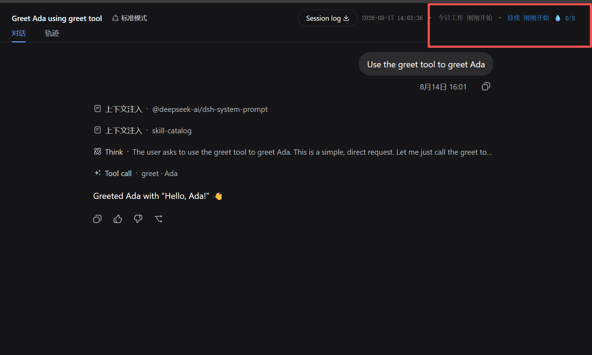
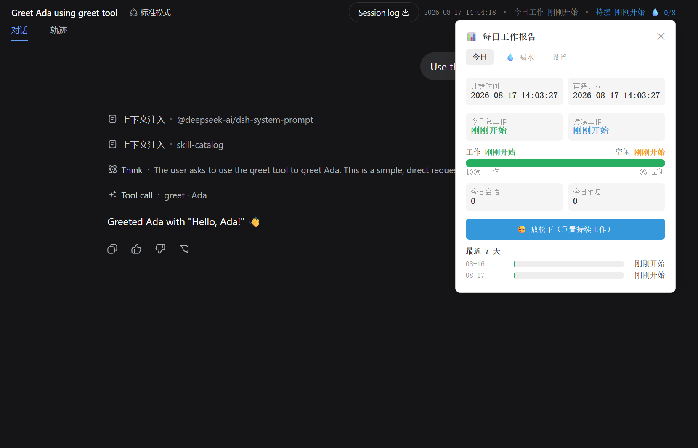
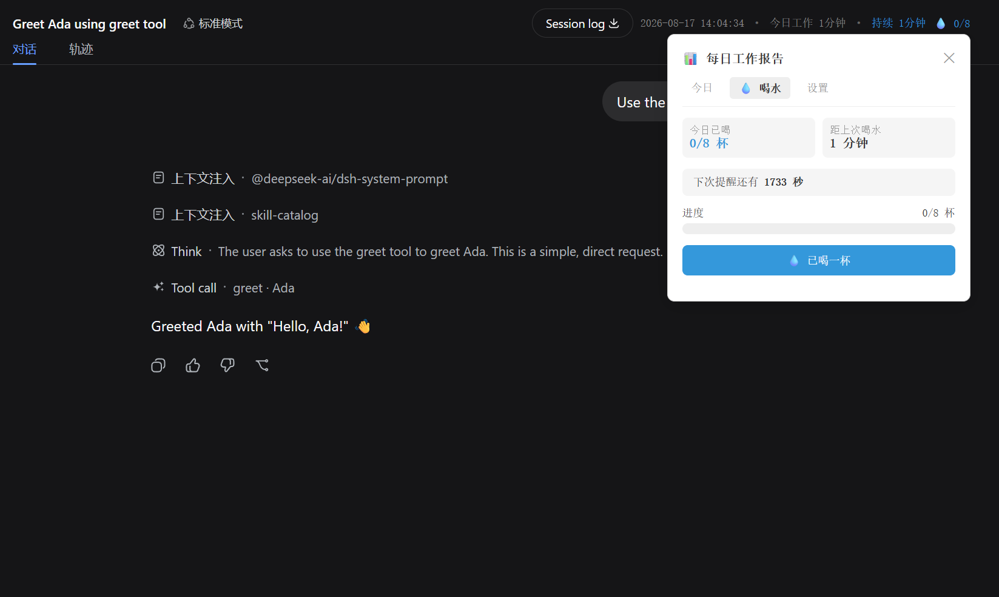
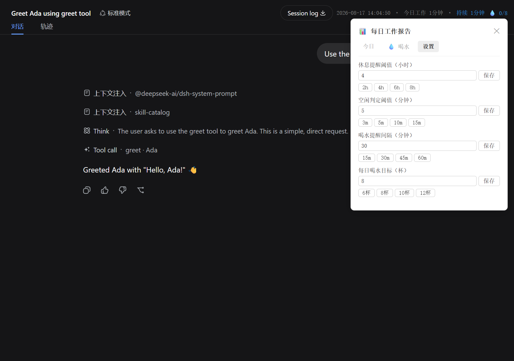

# dsh-office-helper

DSH (DeepSeek Harness) 浏览器端办公助手插件，帮助你在日常工作中养成健康的办公习惯。

## ✨ 功能特性

- ⏰ **工作时间追踪** — 自动记录每日首次打开 DSH 的时间作为工作起点，并结合会话消息时间精准推算
- 💤 **空闲检测** — 监测鼠标/键盘交互，识别 AFK 状态
- ☕ **休息提醒** — 持续工作超过阈值（默认 4 小时）时弹窗提醒休息
- 💧 **喝水提醒** — 按自定义间隔（默认 30 分钟）提醒喝水，追踪每日饮水目标
- 📊 **每日统计** — 记录每日工作时长、空闲时长、连续工作时长、会话数等数据
- 🔌 **会话联动** — 自动识别今日最早的会话消息时间作为当日工作起点

## � 功能展示

### 💬 实时会话状态

在 DSH 对话界面的工具栏中，插件注入了紧凑的实时状态卡片，一目了然：

- **⏰ 当前时间** — 精准到秒的实时时钟
- **💧 饮水进度** — 今日已喝杯数 / 目标
- **🎯 工作状态指示器** — 绿色（工作中）/ 黄色（空闲）/ 蓝色（休息中）



### 📊 每日工作时间报告

实时追踪并汇总当日所有工作数据，让你对一天的 productivity 一目了然：

- **总工作时长** — 排除空闲后的纯工作时间
- **空闲时长** — 鼠标/键盘无交互的累计时间
- **连续工作时长** — 当前连续工作的时段
- **会话历史** — 每个会话的起止时间和时长
- **进度条** — 距休息提醒阈值的进度可视化



### 💧 每日喝水报告

科学追踪饮水习惯，保持健康的办公状态：

- **饮水量圆环** — 巨大的可视化进度环显示已喝/目标杯数
- **下次提醒倒计时** — 精确到分钟的提醒预告
- **连续达标天数** — 连续完成目标的 streak
- **饮水时间线** — 每一杯水的精确时间记录



### ⚙️ 插件设置

所有配置项均可在 DSH 界面中直接调整，无需修改代码：

- **休息提醒阈值** — 拖动滑块设定触发休息提醒的连续工作时长
- **空闲检测阈值** — 调整判定 AFK 的无交互时长
- **喝水提醒间隔** — 自定义两次提醒之间的间隔
- **每日饮水目标** — 设定每天的目标喝水杯数
- **一键保存** — 所有设置实时存入 localStorage



## �🛠 技术栈

- **TypeScript** — 类型安全
- **React 18** — 客户端 UI 组件
- **esbuild** — 客户端打包（单文件 CJS）
- **Vitest** — 单元测试（73 个测试用例）

## 📁 项目结构

```
dsh-office-helper/
├── src/
│   ├── client/          # 浏览器侧 UI（React 组件，注入会话头部工具栏）
│   │   └── index.tsx    # UtcClock 组件 + apply() 注册入口
│   ├── work-time.ts     # 核心逻辑：localStorage 存储、计时、统计、喝水追踪
│   ├── utc-string.ts    # 时间格式化工具
│   └── index.ts         # Node 侧入口（空实现，纯 client 插件）
├── lib/                 # 编译产物（tsc + esbuild 生成）
├── scripts/
│   └── build-client.mjs # 客户端打包脚本（esbuild → 单文件 CJS）
├── tests/               # 单元测试
│   ├── work-time.spec.ts
│   └── utc-string.spec.ts
├── package.json
├── tsconfig.json
└── vitest.config.ts
```

## 🚀 快速开始

```bash
# 安装依赖
npm install

# 构建（tsc 编译 + esbuild 打包 client）
npm run build

# 运行测试
npm test
```

## 📦 安装到 DSH

本插件是 **web 平台插件**（纯 client 侧，无 Node 端逻辑）。

### 前置条件

- 已安装 DSH 并能正常运行 `dsh web`
- Node.js ≥ 20
- pnpm ≥ 10

### 方式一：通过 DSH CLI 安装（推荐 ✅）

最简单的方式，一条命令完成安装：

```bash
dsh plugin --profile web add dsh-office-helper@latest
```

然后启动 DSH 即可：

```bash
dsh web
```

**硬刷新浏览器**（Cmd/Ctrl+Shift+R）即可看到插件生效。

> ⚠️ 此方式需要插件已发布到 npm。当前版本尚未发布，请使用下方的方式二。

### 方式二：本地手动安装

适合本地开发调试或未发布到 npm 的场景。

#### 步骤 1：构建插件

```bash
cd dsh-office-helper
npm install
npm run build
```

确保 `lib/` 目录下生成了编译产物。

#### 步骤 2：挂载到 DSH

编辑 `~/.dsh/profiles/web/package.json`，在 `dependencies` 中添加本地引用：

```json
"dsh-office-helper": "link:<插件的绝对路径>"
```

例如：

```json
"dsh-office-helper": "link:D:/path/to/dsh-office-helper"
```

#### 步骤 3：注册插件

编辑 `~/.dsh/profiles/web/cordis.patch.yml`，添加：

```yaml
- insert:
    - id: dsh-office-helper
      name: dsh-office-helper
```

#### 步骤 4：安装并启动

```bash
cd ~/.dsh/profiles/web
pnpm install
dsh web
```

**硬刷新浏览器**（Cmd/Ctrl+Shift+R）即可看到插件生效。

> 本插件的 host 半为空实现（纯 client 插件），仅需修改 `package.json` 和 `cordis.patch.yml`，无需重启 DSH。

## 🔄 更新插件

### CLI 方式更新

如果通过 CLI 安装，更新也很简单：

```bash
dsh plugin --profile web update dsh-office-helper
```

### 本地开发方式更新

修改源码后，重新构建即可：

```bash
cd dsh-office-helper
npm run build
```

然后**硬刷新浏览器**（Cmd/Ctrl+Shift+R）。client 侧改动热加载生效，无需重启 DSH。

## ⚙️ 配置项

插件通过 localStorage 持久化以下设置，在 DSH 界面中可直接调整：

| 配置项 | 默认值 | 说明 |
|---|---|---|
| 休息提醒阈值 | 4 小时 | 持续工作超过此时长弹出休息提醒 |
| 空闲检测阈值 | 5 分钟 | 超过此时长无交互视为空闲 |
| 喝水提醒间隔 | 30 分钟 | 每两次喝水之间的间隔 |
| 每日饮水目标 | 8 杯 | 每日目标喝水杯数 |

## 🧪 开发说明

### 核心逻辑（src/work-time.ts）

所有业务逻辑都抽为**纯函数**，零 React 依赖，毫秒级单测：

- `initWorkStart()` — 初始化/获取当日工作开始时间
- `recordFirstInteraction()` — 记录当日首次交互
- `isIdle()` / `getIdleDuration()` — 空闲检测
- `loadThresholdHours()` / `saveThresholdHours()` — 休息阈值读写
- `markCupDrunk()` / `shouldRemindWater()` — 喝水追踪
- `loadDailyStats()` / `accumulateWorkTime()` — 每日统计

### 客户端（src/client/index.tsx）

通过 DSH 的 slot 机制注入组件：

- `apply()` 将 `UtcClock` 组件注册到 `conversation.session.header.utilities` 槽位
- 组件挂载后自动追踪工作时间、检测空闲、触发喝水/休息提醒
- 所有状态存入 localStorage，按天重置

## 📄 License

MIT